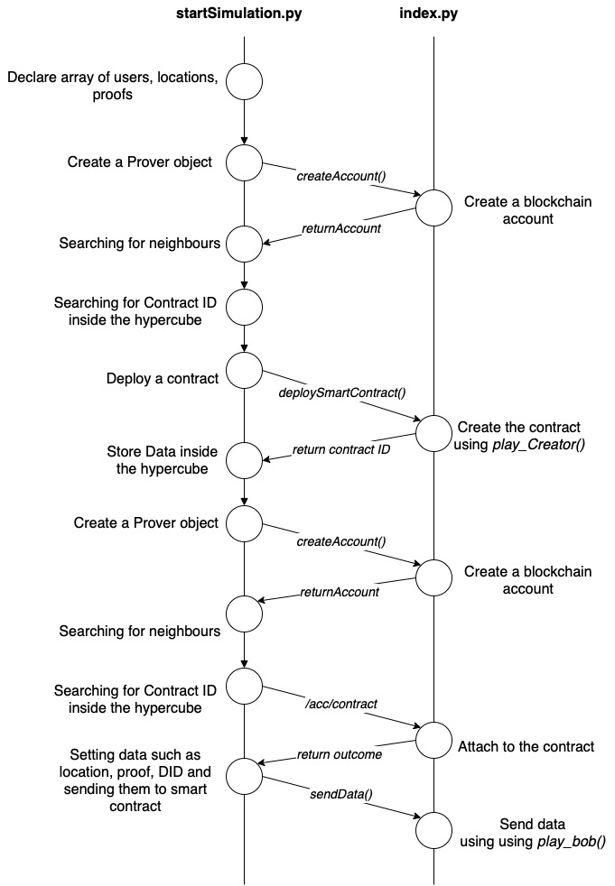

## NOTES

You have to run the project on Ethereum Consensus Network

## Main Features

- [Open Location Code](https://www.placekey.io/blog/google-maps-plus-codes-location-keys)
- Reach
- Python

##  Run

You have to [install Reach](https://docs.reach.sh/quickstart/) and start the docker. 
To run the **simulation.py** script, use:
- `pip install -r requirements.txt`
- `pip install --upgrade reach-rpc-client`
- `./reach rpc-run python3 -u ./index.py`

If you want to try the simulation use:
- `./reach rpc-run python3 -u ./startSimulation.py`

## How it works
- **index.rsh**: Smart Contract backend code;
- **index.py**: Frontend code (that interact with Smart Contract backend code);
- **startSimulation**: Simulation script that will call function inside __index.py__ to interact with Smart Contract.

# Author
Michele Bonini
