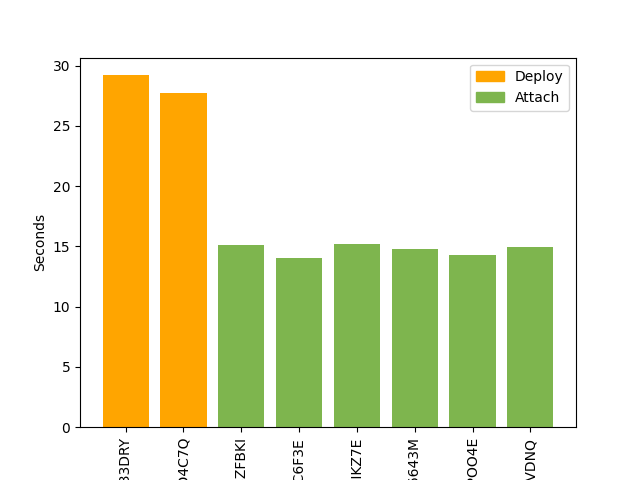

## This script must be run on ALGORAND testnet

### Info

At the moment, the following system contains 8 prover where 2 are creators and 6 are the neighbours.
In particular:
- **1° Smart contract associated to 7H369F4W+Q8 location:** prover with DID 2 is the creator and his neighbours are 6, 50 and 51;
- **2° Smart contract associated to 7H369F4W+Q9 location:** prover with DID 8 is the creator and his neighbours are 9, 10 and 11;
- **3° Smart contract associated to 7H368FRV+FM location:** prover with DID 12 is the creator and his neighbours are 13, 14 and 15;
- **4° Smart contract associated to 7H368FWV+X6 location:** prover with DID 16 is the creator and his neighbours are 17, 18 and 19.

## Main Features

- [Open Location Code](https://www.placekey.io/blog/google-maps-plus-codes-location-keys)
- Reach
- Python

##  Run

You have to [install Reach](https://docs.reach.sh/quickstart/) and start the docker. 
To run the **index.py** script, use:
- `pip install -r requirements.txt`
- `pip install --upgrade reach-rpc-client`
- `./reach rpc-run python3 -u ./index.py`

If you want to try the simulation use:
- `./reach rpc-run python3 -u ./startSimulation.py`

## How it works

- **index.rsh**: Smart Contract backend code;
- **index.py**: Frontend code (that interact with Smart Contract backend code);
- **startSimulation**: Simulation script that will call functions inside index.py to interact with Smart Contract.

Some functionalities of scripts; initial interactions between Deployer and Prover: 

Performance evaluation with Algorand (x: accounts, y: seconds):

Account 1° and 5° deploy new smart contract.

Performance with 16 accounts:

Outcome [not correct | fixed with the new version]:

## If issues comes ...
Try with
- `./reach down`
- `./reach update`

# Author
Michele Bonini
